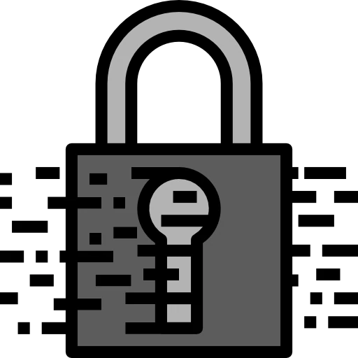
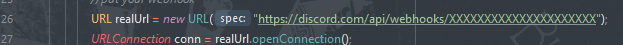
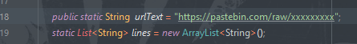
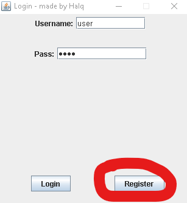
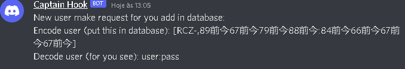

# Login Sytem




# Description

 - This is a super safe login system this use a [RCZ Encrypt System](https://github.com/Halqq/RCZEncryptationKT), it is hard to crack the password and user.

# How to use

- put this package in your project.
- in dev/halq/login/sendrequest/WebHookUtil in line 26, put your discord web hook, this is for send the data to discord.


example:



- in dev/halq/login/verifylogin/GetInfos in line 18, put your server ip, this is for send the data to server (you can use pastebin but is not safe).


example:



- add the code in your main class

```java
Frame.mainUI();
````

- to you add users in database, the user need send request, user can press in register button




- after user press in register button, you will receive a request in discord





- if you want add user in database, you need copy encoded user and pass and put it in database
- example encoded user : RCZ-,89前今67前今79前今88前今:84前今66前今67前今67前今

- after you add user in database, the user can be login pressing in login button


